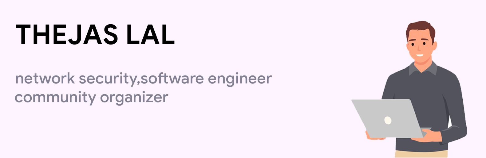

# Hi, I'm Theja 👋🏾 💻

## THEJA

**software engineer, content creator & community organizer**

I'm a Network and Software engineer who is passionate about making contributing to open-source more approachable, creating technology to elevate people, and building community. Some technologies I enjoy working with include Flutter, NodeJS , Anggular , ReactJS, Jamstack (JavaScript, APIs + Markup) Google Cloud , Mongodb and so on with the list that cannot be writable . About Network security, Firewalls and VPNs, Cisco Routers, LAN/WAN connectivity, TCP/IP, communications. Experienced in Network Security, Juniper Firewalls, SSL VPN, Checkpoint, RSA, Cisco Nexus, Cisco ACE, Cisco Wireless, Mikrotik, Sophos, Fortigate, Unifi and So on.... 

---

### Find me around the web 🌎:
- Learning in public on 📺 ✍🏾
- Tinkering with interactions on 🏓
- Sharing updates on 💼
